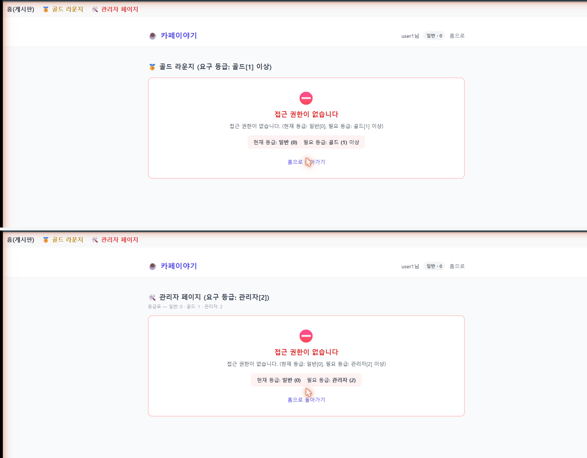
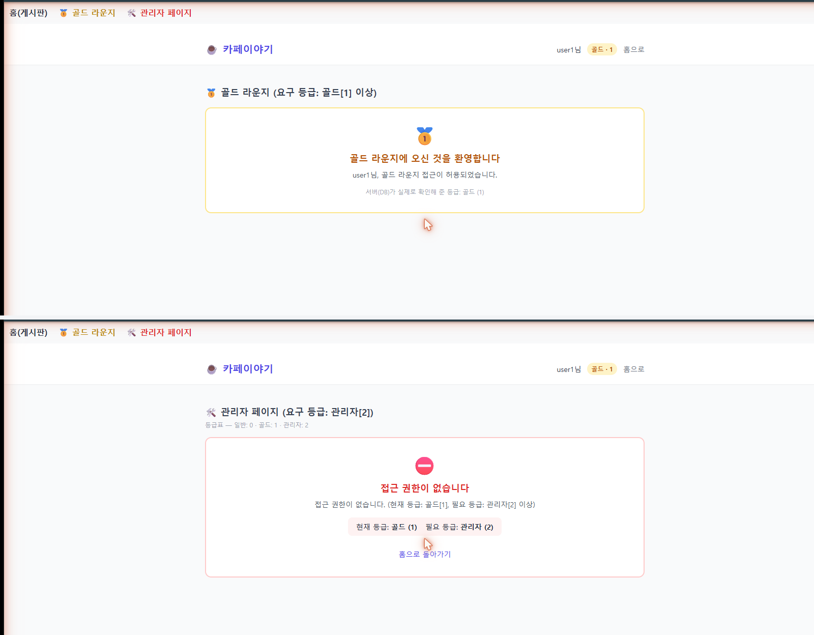
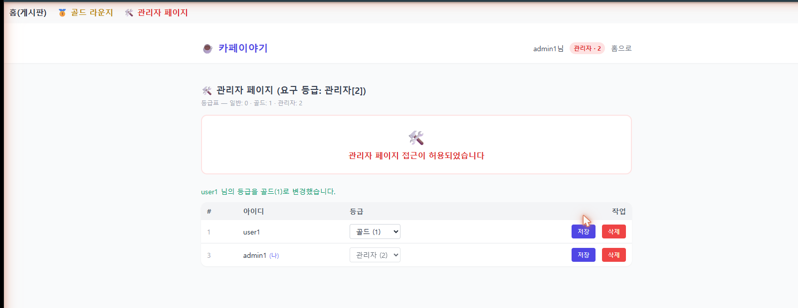
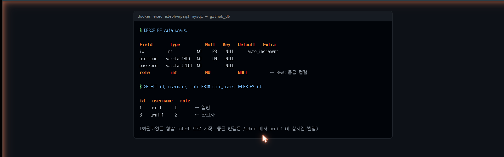

# [미니 실습] 카페이야기 — RBAC(역할 기반 접근 제어) 제출문

- 작업 폴더: `_8_cafe_rbac_test` (`_7_board_test` 를 복제해서 그 안에서 작업)
- 등급 체계: **일반 0 · 골드 1 · 관리자 2**
- 실행 방법: `docker compose up -d` (MySQL) → `_8_cafe_rbac_test` 에서 `python app.py` → `http://localhost:5000`

## 무엇을 만들었나

Flask 게시판(`_7_board_test`)에 RBAC 레이어를 얹었습니다.

- `cafe_users` 테이블에 `role`(0/1/2) 컬럼 추가 — 원본 게시판의 `users` 테이블과 겹치지 않게 별도 테이블명 사용
- 회원가입은 무조건 `role=0`(일반)으로 시작
- `/gold`(골드 이상), `/admin`(관리자)에 등급별 접근 제어 적용 — 등급이 모자라면 화면에 ⛔ 예외 패널 출력 (현재 등급/필요 등급을 숫자로 함께 표기)
- `/admin` 에서 관리자가 전체 회원을 조회·등급 수정·삭제 가능
- 인가 판단은 **매 요청마다 DB를 다시 조회**해서 처리 — 관리자가 등급을 바꾸면 대상자는 재로그인 없이 새로고침만으로 바로 반영됨
- 관리자 본인의 등급 강등·자기 계정 삭제는 서버·화면 양쪽에서 차단

## 요구사항 체크리스트

| # | 요구사항 | 구현 |
|---|---|---|
| 1 | 헤더 + 골드/관리자 링크 | ✅ 상단 nav에 항상 노출 |
| 2 | 골드/관리자 화면 구성 | ✅ `templates/gold.html`, `templates/admin.html` |
| 3 | 회원가입 = 일반 등급 | ✅ `register()` 에서 `role=ROLE_GENERAL` 고정 |
| 4 | 인가/권한 표기 (일반0·골드1·관리자2) | ✅ 헤더 뱃지 + 등급표 + 접근거부 화면에 상시 표기 |
| 5 | 관리자가 회원 조회·수정·삭제 | ✅ `/api/admin/users` GET/PUT/DELETE |
| 6 | 등급 부족 시 화면에 예외 출력 | ✅ "⛔ 접근 권한이 없습니다" 패널 |

## 제출 항목 1 — 로그인 유저 권한·DB·헤더 표기

### 헤더에 로그인 유저명 + 권한이 함께 표기됨

세 등급 모두에서 우측 상단에 "닉네임 + 등급뱃지(이름·숫자)" 가 같이 뜨는 것을 캡처했습니다. 같은 등급끼리는 한 장에 위아래로 합쳤습니다.

**user1 — 일반 등급일 때 (`일반 · 0`)**


**user1 — 골드로 승격된 뒤 (`골드 · 1`)**


**admin1 — 관리자 등급 (`관리자 · 2`)**


### DB 확인

`cafe_users` 테이블 구조(`role` 컬럼 확인)와 실제 저장된 값입니다.



```
DESCRIBE cafe_users;
  role   int   NO   NULL     ← RBAC 등급 컬럼

SELECT id, username, role FROM cafe_users ORDER BY id;
  id  username  role
  1   user1     0     ← 일반
  3   admin1    2     ← 관리자
```

> 참고: 이 화면은 실제 mysql 조회 결과(위 값 그대로, 조작 없음)를 캡처 가능한 화면에 옮겨 담아 찍은 것입니다. 이 PC의 실제 터미널 창에는 자동으로 명령을 입력할 수단이 없어서, 원본 mysql CLI 창을 그대로 캡처하지는 못했습니다. 직접 원본이 필요하면 아래 명령을 터미널에 치고 캡처하면 됩니다.
> ```bash
> docker exec aleph-mysql mysql -uroot -p github_db -e "SELECT id, username, role FROM cafe_users;"
> ```

## 제출 항목 2 — 등급별 화면 접속 시도 결과

| 시도 | 결과 | 캡처 (위에서 이미 첨부한 이미지와 동일) |
|---|---|---|
| user1(일반) → 골드 라운지 | ⛔ 거부 (현재 일반[0], 필요 골드[1] 이상) | `merged_01_user1_general.png` 위쪽 |
| user1(일반) → 관리자 페이지 | ⛔ 거부 (현재 일반[0], 필요 관리자[2] 이상) | `merged_01_user1_general.png` 아래쪽 |
| admin1(관리자) → 관리자 페이지에서 user1 등급을 골드로 변경 | ✅ 허용 + 실시간 변경 성공 메시지 | `03_admin_manage_users.png` |
| user1(골드로 승격됨) → 골드 라운지 | ✅ 허용 ("서버(DB)가 실제로 확인해 준 등급: 골드(1)") | `merged_02_user1_gold.png` 위쪽 |
| user1(골드) → 관리자 페이지 | ⛔ 거부 (현재 골드[1], 필요 관리자[2] 이상) | `merged_02_user1_gold.png` 아래쪽 |

세 등급(일반·골드·관리자) 모두에서 접근 제어가 기대대로 동작하는 것을 확인했고, 관리자가 등급을 바꾼 직후 대상 계정이 재로그인 없이 새 권한을 즉시 받는 것까지 실측으로 확인했습니다.

## 테스트 계정

| 아이디 | 비밀번호 | 등급 |
|---|---|---|
| user1 | pass1234 | 일반 (0) |
| admin1 | pass1234 | 관리자 (2) |

> 최초 관리자(admin1)는 회원가입만으로는 만들 수 없습니다(가입은 항상 일반으로 시작). MySQL에서 `UPDATE cafe_users SET role=2 WHERE username='admin1';` 로 직접 부트스트랩했습니다.

## 막혔던 점 · 해결

- **테스트 계정 등급을 화면에서 바꾸는 도중 창 캡처가 계속 실패함** — PC에서 전체화면 게임이 떠 있어서 Windows가 다른 창으로 포커스를 넘겨주지 않았음. 게임을 종료한 뒤 정상적으로 Chrome 창을 캡처할 수 있었음.
- **로그인/삭제 버튼을 누르면 화면이 멈춘 것처럼 보임** — `alert()`/`confirm()` 네이티브 팝업이 자동화 클릭을 막고 있던 것. 테스트용으로 `window.alert`/`window.confirm` 을 오버라이드해서 확인함 (실제 사용자는 평소처럼 팝업을 보고 확인/취소 누르면 됨).
